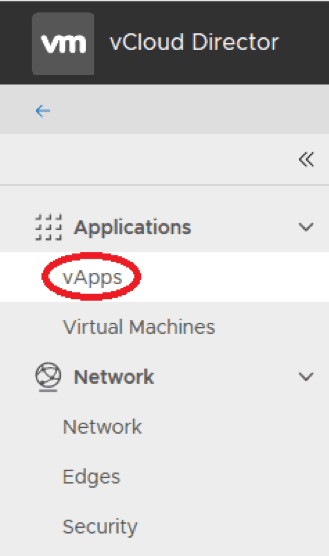
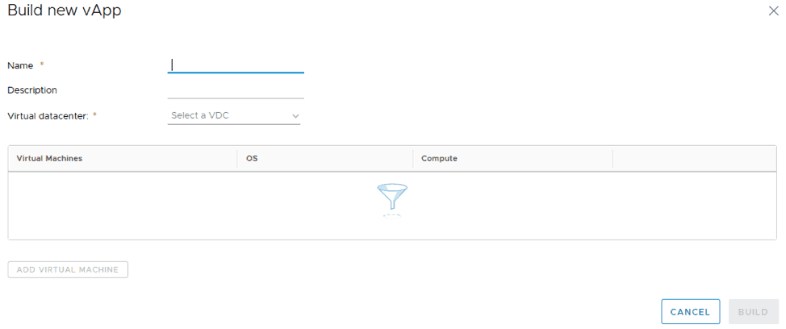
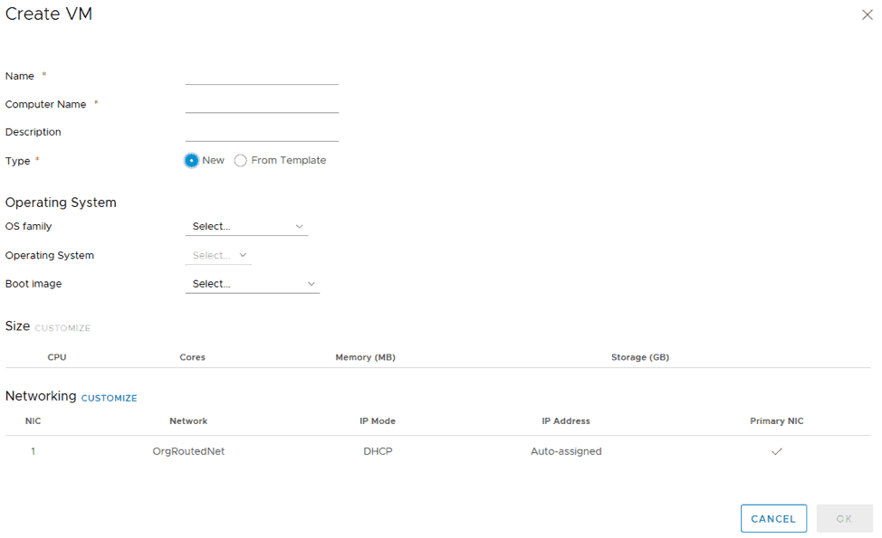
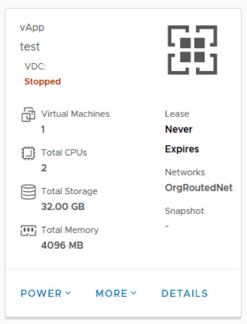
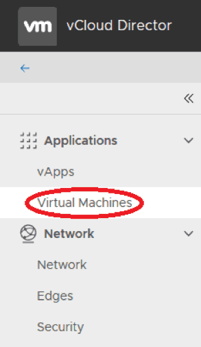
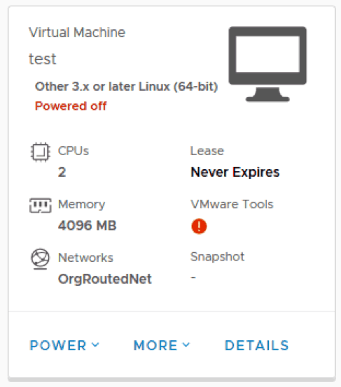

# Virtual Machine Creation and Management With vCloud Director

Within vCloud Director, virtual machines are typically grouped into collections called “vApps”. While it is possible to configure a VM without a vApp, it is still recommended to use vApps as they provide additional functionality.  For example, your networks can be configured so that VMs within a vApp can communicate with each other, but cannot communicate with other vApps.  vApps can also be easily duplicated if you have a collection of VMs that are always deployed together.

## Create a vApp

To access the vApp screen, click the “vApps” entry in the menu on the left side of the screen:

Click on the “Build New vApp” button at the top of the screen to start building a new vApp.

A name for the vApp is required, and an optional description text field is also provided. Once you click on “Select a VDC” menu, a list of your Virtual datacenters will pop up. Most clients will only have one and should select it.

## Virtual Machine Creation

Click “Add Virtual Machine” to add the first virtual machine to this vApp.

If your organization has a VM template on it that you wish to use, you can select “From Template” and select the template you wish to clone. Otherwise, set “Type” to “New” to see the full list of settings:

These will be configured as follows:

-   **Name**: The name you want to display for this VM within vCloud Director.
-   **Computer Name**: The hostname of the guest system.
-   **Description**: An optional text description of the machine.
-   **Type**: Should be set to “New” unless using a template.
-   **OS family**: Set this to the operating system family that best matches your desired guest OS.
-   **Operating System**: Set this to the specific operating system you plan on installing within the guest OS. Note that this only configures the VM for compatibility with this guest – it does not actually install the guest OS selected.
-   **Boot image**: If you have installation media uploaded to your catalog, you can select it here, and it will be automatically connected to the VM upon creation. If not, you can connect it manually later.
-   **Size**: This will pre-populate with a list of common VM sizes based on the operating systems selected. Select a size from the list shown. If none of the shown settings match your desired configuration, click “Customize” to be taken to the detailed sizing settings, where you can manually configure the following:

-   **Virtual CPUs**: This is the total number of virtual CPUs that will be assigned to the VM. One virtual CPU is approximately equal to one physical CPU core.
-   **Cores per socket**: This controls how many sockets the guest OS will see. It does not modify the number of cores, only how they are presented to the guest.  In most cases (and especially for VMs that are not very large), this should be set to the same as the Virtual CPUs setting.
-   **Memory**: Virtual RAM assigned to the VM, shown in megabytes.
-   **Storage**: This allows you to add and configure the size of virtual hard disks.
-   **Networking**: By default, this will be connected to your routed network created earlier. If you need to change the network, IP allocation, or add more virtual NICs, click the “Customize” button to do so.

Click the “OK” button to apply these settings to the VM.  This will return you to the “Build new vApp” screen.  You may repeat the process above if you want to add more VMs at this time, or you can add more VMs at a later date.

Once you have added your initial VM(s) to the vApp, click “Build” to create the vApp.

Once the vApp has been created, it will show an entry on the vApp screen:

The buttons at the bottom of the vApp allow you to control the vApp as a whole, or modify it:

-   **Power**: This will enable you to power on, power off, suspend, or reset the entire vApp.
-   **More**: This shows further settings and functionality to manage the vApp.Additional details on these functions are available within the online Help.
-   **Details**: This will open the vApp and show you a detailed list of the VMs, as well as additional settings related to the vApp:

Clicking on the Virtual Machine in the top pane will bring you to the settings of that VM, which allow you to further customize the VM and its virtual hardware.

Alternatively, you can also click on the “Virtual Machines” item in the menu on the left, and see a list of all VMs in all vApps:

The VMs on this screen will each have an entry as shown:

If you have not already connected install media to a VM, you can do it on this screen by clicking “More,” then “Insert Media.” If you have already connected install media or created a VM from a template, you can power on the VM, then click “More,” and click “Launch Web Console” to manage the VM directly.
